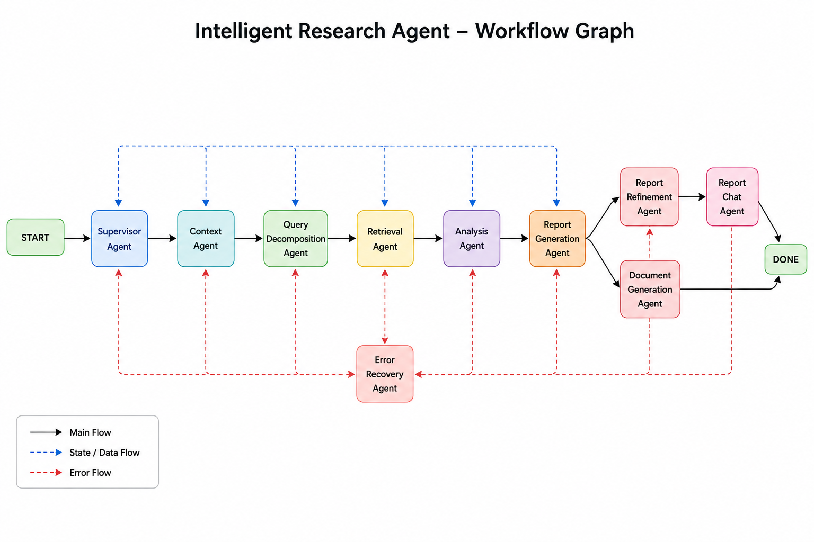

# Intelligent Research Workspace

A full-stack AI research workspace built around a LangGraph-driven multi-agent pipeline, semantic retrieval, structured report generation, report refinement, conversational report Q&A, and PDF export.

## Key Features

- Generate professional research reports from a natural research query
- Refine reports section-by-section without regenerating the full document
- Chat with generated reports using compressed report memory
- Export reports as downloadable PDFs
- Track report version history in the Streamlit workspace
- Stream workflow execution and logs in real time inside Streamlit
- Run a FastAPI chat endpoint for programmatic access
- Multi-source retrieval from Tavily web search, arXiv, and Wikipedia

## Repository Structure

- `api/` — FastAPI application entrypoints, request/response models, and session persistence
- `agents/` — workflow agent classes that implement each stage of the research pipeline
- `graph/` — LangGraph workflow graph builder, routing, executor, and node wiring
- `config/` — environment loading and runtime settings
- `memory/` — session memory, long-term summary memory, and memory management helpers
- `state/` — typed state definitions, schemas, models, and validation utilities
- `streamlit_app/` — Streamlit UI flow and application interface
- `tests/` — unit and integration tests for repository behavior
- `tools/` — reusable workflow tool helpers and domain-specific utilities
- `utils/` — model factories, state helpers, persistence utilities, and logging
- `docs/` — documentation assets, including the workflow diagram
- `main.py` — application entrypoint for local CLI-style execution

## Workflow Diagram



## Architecture Overview

The repository implements a LangGraph workflow graph with dedicated nodes for:

- `supervisor` — workflow orchestration and routing
- `context` — contextual query processing
- `query_decomposition` — decomposing research queries into retrieval sub-queries
- `retrieval` — multi-source document retrieval and semantic filtering
- `analysis` — extracting findings, summaries, contradictions, and confidence scores
- `report_generation` — generating a structured research report
- `report_refinement` — editing or extending specific report sections
- `report_chat` — answering questions about the active report
- `document_generation` — creating PDF output
- `error_recovery` — handling workflow failures

## Workflow Overview

The system supports three main report workflows and a document export flow.

### Report Generation Workflow

The report generation pipeline is driven by the supervisor node and follows this flow:

- `StateFactory.create_initial_state()`
- `Supervisor Agent` → `Workflow Decision Node`
- `REPORT_GENERATION`
  - `Context Agent` → `Query Contextualization` (`contextualized_query`)
  - `Query Decomposition Agent` → `Generate Sub Queries` (`Web / Arxiv / Wiki`)
  - `Retrieval Agent` → `Tavily Retrieval`, `Arxiv Retrieval`, `Wikipedia Retrieval`, `Deduplication`, `Semantic Chunking`, `Chroma Storage`, `Semantic Retrieval`, `Reranking`
  - `Analysis Agent` → `Key Findings Extraction`, `Contradictions Analysis`, `Citation Mapping`, `Confidence Scoring`
  - `Report Generation Agent` → `Title Generation`, `Abstract Generation`, `Introduction Generation`, `Structured Report Build`, `References Formatting`, `Compression Context`
- `Final Report` → `Active Workspace State`, `Version History Update`

### Report Refinement Workflow

- `Report Refinement Agent` → `Section Identification`, `Targeted Refinement`, `Section Replacement`, `Report Reconstruction`, `Context Compression`, `Version Update`
- `Updated Active Report` → `Same Chroma Collection`, `Same Workspace Context`

### Report Chat Workflow

- `Report Chat Agent` → `Compressed Context Q&A`, `Workspace-Aware Chat`, `Citation Grounding`, `Semantic Retrieval`
- `Conversational Response` → `Chat History Persistence`

### Document Generation Workflow

- `Document Generation Agent` → `PDF Rendering`, `Markdown → PDF`, `Download Generation`
- `Generated PDF` → `Downloadable Version`

### Vectorstore Architecture

The repository uses session-scoped ChromaDB collections to isolate report-specific semantic data and avoid contamination:

- `Session A` → `research_<id_A>`
- `Session B` → `research_<id_B>`
- `Session C` → `research_<id_C>`

This prevents:

- cross-report contamination
- stale semantic retrieval
- unrelated chunk leakage
- citation drift

### Streaming Execution Flow

The live execution path is:

- `LangGraph astream(values)`
- `GraphExecutor.stream_workflow()`
- `current_step Tracking`
- `Step Event Mapping`
- `Streamlit Live Updates`

```text
                        ┌──────────────────────┐
                        │      USER QUERY      │
                        └──────────┬───────────┘
                                   │
                                   ▼
                     ┌──────────────────────────┐
                     │     StateFactory         │
                     │  create_initial_state()  │
                     └──────────┬───────────────┘
                                │
                                ▼
                    ┌───────────────────────────┐
                    │      Supervisor Agent     │
                    │   Workflow Decision Node  │
                    └──────────┬────────────────┘
                               │
        ┌──────────────────────┼────────────────────────┐
        │                      │                        │
        ▼                      ▼                        ▼

┌──────────────────┐  ┌────────────────────┐  ┌────────────────────┐
│ REPORT_GENERATION│  │ REPORT_REFINEMENT  │  │    REPORT_CHAT     │
└────────┬─────────┘  └─────────┬──────────┘  └─────────┬──────────┘
         │                      │                       │
         ▼                      ▼                       ▼

╔══════════════════════════════════════════════════════════════════╗
║                  REPORT GENERATION WORKFLOW                      ║
╚══════════════════════════════════════════════════════════════════╝

            ┌──────────────────────────┐
            │      Context Agent       │
            │ Query Contextualization  │
            │  contextualized_query    │
            └────────────┬─────────────┘
                         │
                         ▼
            ┌──────────────────────────┐
            │ Query Decomposition Agent│
            │ Generate Sub Queries     │
            │ Web / Arxiv / Wiki       │
            └────────────┬─────────────┘
                         │
                         ▼
            ┌──────────────────────────┐
            │     Retrieval Agent      │
            │ Tavily Retrieval         │
            │ Arxiv Retrieval          │
            │ Wikipedia Retrieval      │
            │ Deduplication            │
            │ Semantic Chunking        │
            │ Chroma Storage           │
            │ Semantic Retrieval       │
            │ Reranking                │
            └────────────┬─────────────┘
                         │
                         ▼
            ┌──────────────────────────┐
            │      Analysis Agent      │
            │ Key Findings Extraction  │
            │ Contradictions Analysis  │
            │ Citation Mapping         │
            │ Confidence Scoring       │
            └────────────┬─────────────┘
                         │
                         ▼
            ┌──────────────────────────┐
            │ Report Generation Agent  │
            │ Title Generation         │
            │ Abstract Generation      │
            │ Introduction Generation  │
            │ Structured Report Build  │
            │ References Formatting    │
            │ Compression Context      │
            └────────────┬─────────────┘
                         │
                         ▼
            ┌──────────────────────────┐
            │      Final Report        │
            │  Active Workspace State  │
            │ Version History Update   │
            └──────────────────────────┘


╔══════════════════════════════════════════════════════════════════╗
║                   REPORT REFINEMENT WORKFLOW                     ║
╚══════════════════════════════════════════════════════════════════╝

                ┌──────────────────────────┐
                │ Report Refinement Agent  │
                │ Section Identification   │
                │ Targeted Refinement      │
                │ Section Replacement      │
                │ Report Reconstruction    │
                │ Context Compression      │
                │ Version Update           │
                └────────────┬─────────────┘
                             │
                             ▼
                ┌──────────────────────────┐
                │ Updated Active Report    │
                │ Same Chroma Collection   │
                │ Same Workspace Context   │
                └──────────────────────────┘


╔══════════════════════════════════════════════════════════════════╗
║                     REPORT CHAT WORKFLOW                         ║
╚══════════════════════════════════════════════════════════════════╝

                ┌──────────────────────────┐
                │     Report Chat Agent    │
                │ Compressed Context Q&A   │
                │ Workspace-Aware Chat     │
                │ Citation Grounding       │
                │ Semantic Retrieval       │
                └────────────┬─────────────┘
                             │
                             ▼
                ┌──────────────────────────┐
                │ Conversational Response  │
                │ Chat History Persistence │
                └──────────────────────────┘


╔══════════════════════════════════════════════════════════════════╗
║                 DOCUMENT GENERATION WORKFLOW                     ║
╚══════════════════════════════════════════════════════════════════╝

                ┌──────────────────────────┐
                │ Document Generation Agent│
                │ PDF Rendering            │
                │ Markdown → PDF           │
                │ Download Generation      │
                └────────────┬─────────────┘
                             │
                             ▼
                ┌──────────────────────────┐
                │      Generated PDF       │
                │ Downloadable Version     │
                └──────────────────────────┘


╔══════════════════════════════════════════════════════════════════╗
║                    VECTORSTORE ARCHITECTURE                      ║
╚══════════════════════════════════════════════════════════════════╝

                ┌────────────────────────────┐
                │      Session Scoped        │
                │      ChromaDB Store        │
                └────────────┬───────────────┘
                             │

            ┌────────────────┼────────────────┐
            │                │                │

            ▼                ▼                ▼

        ┌──────────────┐ ┌──────────────┐ ┌──────────────┐
        │ Session A    │ │ Session B    │ │ Session C    │
        │ AI Research  │ │ Chemistry    │ │ Biology      │
        └──────┬───────┘ └──────┬───────┘ └──────┬───────┘
               │                │                │
               ▼                ▼                ▼
        research_<id_A>   research_<id_B>   research_<id_C>


Isolated collections prevent:
- cross-report contamination
- stale semantic retrieval
- unrelated chunk leakage
- citation drift


╔══════════════════════════════════════════════════════════════════╗
║                    STREAMING EXECUTION FLOW                      ║
╚══════════════════════════════════════════════════════════════════╝

                    LangGraph astream(values)
                                │
                                ▼
                    GraphExecutor.stream_workflow()
                                │
                                ▼
                    current_step Tracking
                                │
                                ▼
                    Step Event Mapping
                                │
                                ▼
                    Streamlit Live Updates
```

## Tech Stack

- Python
- Streamlit
- FastAPI
- LangGraph
- LangChain
- Tavily
- arXiv API
- Wikipedia API
- ReportLab
- Chroma / vector search utilities
- Groq, HuggingFace, OpenAI, Google generative APIs support via environment configuration

## Project Structure

- `main.py` — example terminal workflow runner using `GraphExecutor`
- `api/` — FastAPI backend with `/chat` endpoint
- `agents/` — workflow agent implementations
- `graph/` — LangGraph graph builder, executor, and router
- `memory/` — session and summary memory support
- `state/` — shared workflow state schema and models
- `streamlit_app/` — Streamlit UI for research generation, refinement, chat, and PDF export
- `tools/` — reusable helpers for search, analysis, report generation, compression, and PDF creation
- `utils/` — factories, state management, logging, retry handlers, and vector store utilities
- `config/` — settings loader and environment variable mapping

### Core File Structure

```text
Intelligent-Research-Agent/
├── api/
│   ├── app.py
│   ├── models.py
│   ├── routes.py
│   └── session_manager.py
├── agents/
│   ├── analysis.py
│   ├── context_agent.py
│   ├── document_generation_agent.py
│   ├── query_decomposition.py
│   ├── report_chat_agent.py
│   ├── report_generation.py
│   ├── report_refinement_agent.py
│   ├── retrieval.py
│   ├── supervisor_agent.py
│   └── report_summary_agent.py
├── chroma_db/
│   ├── chroma.sqlite3
│   └── 413ca162-f201-45a0-b5df-63e852915e6d/
├── config/
│   ├── __init__.py
│   └── settings.py
├── graph/
│   ├── builder.py
│   ├── executor.py
│   ├── nodes.py
│   └── router.py
├── memory/
│   ├── __init__.py
│   ├── memory_manager.py
│   ├── session_memory.py
│   └── summary_memory.py
├── state/
│   ├── __init__.py
│   ├── constants.py
│   ├── models.py
│   └── schema.py
├── streamlit_app/
│   └── app.py
├── tests/
│   ├── __init__.py
│   ├── integration/
│   └── unit/
├── tools/
│   ├── analysis_tools.py
│   ├── chunking_tools.py
│   ├── compression_tools.py
│   ├── context_tools.py
│   ├── decompose_tools.py
│   ├── document_tools.py
│   ├── report_chat_tools.py
│   ├── report_compression_tools.py
│   ├── report_refinement_tools.py
│   ├── report_section_tools.py
│   ├── report_tools.py
│   ├── reranking_tools.py
│   ├── search_tools.py
│   ├── supervisor_tools.py
│   └── vector_tools.py
├── utils/
│   ├── __init__.py
│   ├── embedding_factory.py
│   ├── json_parser.py
│   ├── llm_factory.py
│   ├── llm_retry_handler.py
│   ├── logger.py
│   ├── reranker_factory.py
│   ├── state_factory.py
│   ├── state_manager.py
│   ├── state_reset.py
│   └── vector_store.py
├── main.py
├── pyproject.toml
├── README.md
├── requirements-dev.txt
└── requirements.txt
```

## Installation

```bash
git clone <repository-url>
cd Intelligent-Research-Agent
python -m venv myenv
source myenv/bin/activate
pip install -r requirements.txt
```

## Environment Variables

Create a `.env` file or export these variables before running the app:

```env
GROQ_API_KEY=your_groq_api_key
TAVILY_API_KEY=your_tavily_api_key
LANGCHAIN_API_KEY=your_langchain_api_key
HF_TOKEN=your_huggingface_token
LANGCHAIN_TRACING_V2=true
GOOGLE_API_KEY=your_google_api_key
OPENROUTER_API_KEY=your_openrouter_key
```

The repository also supports optional provider configuration via `LANGCHAIN_PROJECT` and `LANGCHAIN_ENDPOINT`.

## Running the Application

### Streamlit UI

```bash
streamlit run streamlit_app/app.py
```

### FastAPI Backend

```bash
uvicorn api.app:app --reload
```

### Terminal Workflow Example

```bash
python main.py
```

## Usage

1. Open the Streamlit app.
2. Enter a research topic.
3. Generate a research report.
4. Review the generated report and optionally refine sections or ask follow-up questions.
5. Generate and download a PDF from the built-in export flow.

## Retrieval and Analysis

The system retrieves documents from several sources:

- Tavily web search
- arXiv literature
- Wikipedia

It then performs analysis, extracts key findings, builds citations, and generates a grounded report.

## PDF Export

The Streamlit app supports PDF generation using ReportLab, including full report export and version-specific PDF downloads.

## API Endpoint

The FastAPI service exposes a single endpoint:

- `POST /chat` — accepts `session_id` and `query`, runs the workflow, and returns a final report response.

## Notes

- `requirements-dev.txt` is currently empty in this repository.
- `pyproject.toml` is present but not populated in this workspace.
- The Streamlit workspace maintains report history and session state for iterative refinement and report chat.

## Author

M Teja Aravind Siddartha
